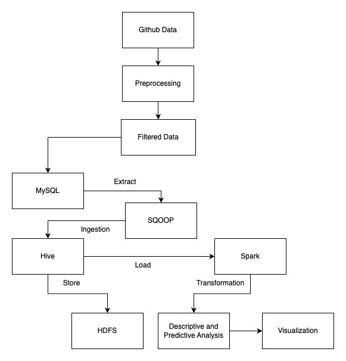
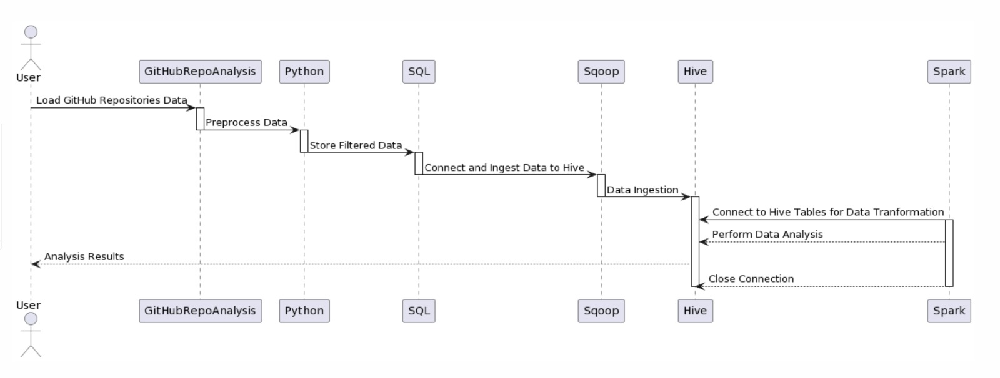
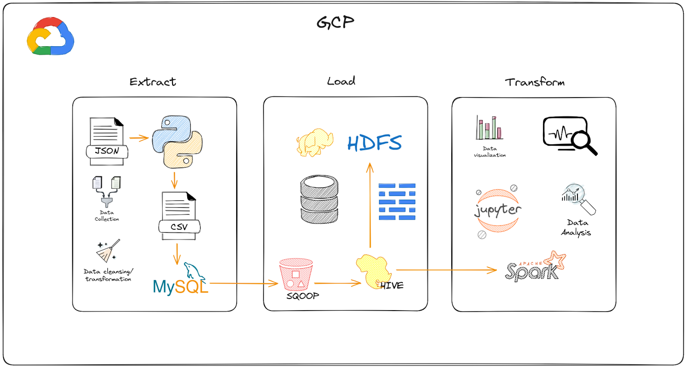

# GitHub Repository Data Engineering and Analysis using SQOOP, Hive, Spark

---

## ABSTRACT

Organizations need effective tools to acquire, handle, and visualize massive amounts of data in the current data-driven world. The utilization of Sqoop for data ingestion, Hadoop for data storage, Hive and Spark for data processing, and data visualization to create an end-to-end data pipeline is covered in this project. Hive and Spark offer robust data processing and transformation capabilities, while Sqoop effectively imports data from relational databases into Hadoop clusters. Through the integration of these tools, the project showcases the development of an efficient, scalable, and maintainable data pipeline that facilitates data-driven decision-making and drives business growth. 

---

## INTRODUCTION
GitHub is a key platform in the ever-changing software development industry. It houses a vast array of repositories that together represent the global developer community's collaborative efforts. This project provides a thorough look at the patterns and dynamics present in the GitHub repository ecosystem. It has a wide range of repositories and illustrates how programming languages, repository numbers and their paths have changed throughout time. Through this project, the goal is to provide developers, scholars, and industry enthusiasts with useful information about the complex history of GitHub. The goals are to identify trends in language use, identify time variations in the development of repositories, and uncover hidden connections in the data. 

---

## Project Goals & Objectives

### Goals:
The primary goal of this project is to analyze and visualize GitHub repository data to gain insights into programming language trends, repository growth, and the evolving landscape of software development communities. This project aims to uncover meaningful patterns and changes in language preferences and repository dynamics over time.

### Objective:
The objective is to analyze GitHub repository data, tracking the evolution of programming language usage trends over different years. This involves constructing a robust data pipeline, exploring language adoption rates, and identifying declining languages. The goal is to provide actionable insights for developers, enabling informed decisions about language preferences and emerging technologies.

---

## Project Scope

- Analyzing GitHub repository data to track language usage trends from 2014 to 2022.
- Identifying the top and bottom programming languages based on repository counts.
- Creating visualizations depicting language adoption and decline over the years.
- Exploring trends and providing insights into language popularity and decline factors.

---

## Project Limitations & Constraints

- **Data limitations**: Analysis based on available GitHub repository data might not capture the entirety of programming language usage.
- Scope restricted to GitHub repositories and might not reflect broader industry trends.
- Analysis limited to language popularity within the GitHub community.
- Interpretation is limited to the information available in the dataset.

---

## Feasibility Study

The feasible study incorporates an analysis within the 2014–2022 timeframe of the dataset. Based on repository counts, the most popular programming languages and those with decreasing adoption trends are identified in this analysis. The study intends to shed light on the evolving preferences within the GitHub community by visualizing and interpreting language adoption and decreasing trends over the course of these years. Using the data at hand, the research attempts to identify patterns and observable trends in order to provide insightful information on programming language preferences and how they have changed over the given period of time.

---

## SYSTEM REQUIREMENT SPECIFICATIONS

### Software Requirements: 

- Google Cloud Platform (GCP): The system requires access to the Google Cloud Platform for cloud-based services and resources.
- Linux Tools: Utilize essential Linux tools, including Wget, Curl, and Docker, to facilitate seamless deployment and management of software components.
- Database Management: 
  - MySQL: Ensure compatibility with MySQL for robust and scalable relational database management.
  - Sqoop: Implement Sqoop for efficient data transfer between Hadoop and relational databases.

### Data Processing and Storage:

- Hive: Utilize Hive for data warehousing and SQL-like queries on large datasets stored in Hadoop-compatible file systems.
- Hadoop Distributed File System (HDFS): Leverage HDFS for distributed storage and processing of large datasets.

### Big Data Processing:

- Apache Spark: Integrate Spark for fast and parallel processing of large datasets.
- Notebook Environment:
  - Jupyter: Provide a Jupyter notebook environment for interactive and collaborative data analysis and visualization.

### Hardware Requirements:
- Processor (CPU): AMD Rome 4 Core: The system is optimized for the AMD Rome 4 Core processor, ensuring efficient data processing and computation.
- Memory (RAM): 32 GB (Recommended): Allocate a minimum of 32 GB of RAM to support concurrent and memory-intensive data processing tasks.
- Storage (Disk Space): Ensure a minimum of 60GB of disk space for the installation of software components, temporary files, and data storage.
- Architecture: The system architecture should be x86/64 to ensure compatibility with the specified software components.

### Network Configuration:
- Firewall Rules: Configure the firewall to allow external access to the Hive port, ensuring accessibility outside the virtual machine for seamless data querying and retrieval.

---

## SYSTEM DESIGN

### Architectural Diagram



### Sequence Diagram



---

## DATA DESIGN

### ELT Process
This pipeline leverages the ELT (Extract, Load, Transform) process to seamlessly manage data. Initially, information is extracted, followed by efficient loading into Hadoop. Subsequently, the data transforms, enabling insightful analysis and facilitating the creation of compelling visualizations.



### Extraction:

- Source Data: The initial step involves extracting data from GitHub repositories. This data is in JSON format, reflecting the semi-structured nature of GitHub data.

- Preprocessing: Preprocessing scripts are run to clean and remove unwanted data and store it in CSV format and MySQL. 

### Load:

- Sqoop: Sqoop is connected to MySQL and loads the data into the Hadoop ecosystem. 

- Hive & HDFS: Hive tables are created and the data is stored in HDFS via SQOOP.  

### Transformation:

- Spark Transformation: The data is loaded from Hive and transformations are done using Apache Spark. This includes selecting numerical columns, handling null values, vectorizing features, and calculating correlation matrices.

---

## DATA MANAGEMENT

### Collection:

- GitHub Repositories Data: The semi-structured data in JSON format is processed through Python scripts to clean, extract and store in MySQL database. 
Storage:

- HDFS: Data is stored in HDFS through SQOOP and hive, which provides a distributed and fault-tolerant storage solution.

- Replication Strategies: HDFS inherently replicates data across multiple nodes for fault tolerance. We have 1 name node and 2 data nodes deployed using docker.

---

## DATA ENGINEERING

### Planning:

- Find an appropriate dataset/data source.
- Ensure data quality and consistency.
- Facilitate seamless integration with analytical tools.

### Processing:

- Cleaning and Transforming Data: Data engineering involves cleaning and transforming raw data into a structured format suitable for analysis. This is done through 
- Validation: Data validation is done in MySQL after inserting the cleaned data. The validation is done by querying the rows to find NULL and empty values.

---

## DATA ANALYTICS AND MODELING

### Statistical Analysis:

Statistical analysis is crucial in understanding trends and patterns within datasets. In the context of GitHub repository data, conducting statistical analysis aids in uncovering insights into programming language usage, trends, and their evolution over time. By applying statistical methods, we gain a clearer understanding of language popularity, changes in usage, and the dynamics of software development ecosystems. This analysis helps in making informed decisions, such as resource allocation, language adoption, and identifying emerging technologies, crucial for software development and strategic planning.

### Predictive Analysis:

To predict language growth or decline, the predictive model used in this analysis—a Decision Tree Classifier—utilizes historical GitHub repository data. This model forecasts the possibility of a programming language becoming more or less popular over time by using characteristics such as repository names and primary programming languages. Based on historical usage patterns, the Decision Tree Classifier provides insights into possible future trends in language adoption, but with limitations on depth and sample splits.

Proactive planning is made possible by this predictive technique, which also helps with strategic decision-making and the identification of languages that are anticipated to become more or less relevant in the software development industry.

---

## DATA VISUALIZATION

Data visualization is essential to the examination of GitHub repositories because it converts unprocessed data into graphical representations. It is possible to easily comprehend complicated trends, patterns, and correlations in programming language usage by using visualizations such as bar charts, heatmaps, and line graphs. In addition to making complicated data easier to understand, visualizations enable decision-makers by providing a story that is easily understood and drawn from the repository dataset.

### Techniques Used:

- Heatmaps: Utilized for visualizing correlation matrices and relationships between numerical features.
- Bar Charts: Representing the number of repositories created each year.
- Color Gradient: Applied to bar charts for visual appeal and differentiation.
- Line Graphs: Depicting trends in the usage of top programming languages over the years.

These techniques collectively provide a comprehensive view of the analyzed data, making it more accessible and understandable for stakeholders involved in the project.

---

## CODE/SETUP

- Clone the entire repo
- Change directory to docker_exp and execute the below command to run all the containers related to the hadoop setup

```bash 
cd docker_exp

docker-compose up -d
```

- Run the below commands in order to complete the data flow process i.e. the Load part in the ELT process.

```bash 
# copy dataset to trusted mysql folder
docker cp ~/dataset/filtered_output.csv ra_mysql:/var/lib/mysql-files/filtered_output.csv

docker exec -it ra_mysql bash

# MySQL commands

mysql -u root -p 

# Enter example as password when prompted

CREATE DATABASE github;

USE github;

CREATE TABLE github_projects (
    name VARCHAR(255),
    stars INT,
    forks INT,
    watchers INT,
    pullRequests INT,
    primaryLanguage VARCHAR(50),
    defaultBranchCommitCount VARCHAR(100),
    createdAt VARCHAR(100),
    licence VARCHAR(255)
);

# Load the CSV data into mySQL

LOAD DATA INFILE '/var/lib/mysql-files/filtered_output.csv'
INTO TABLE github_projects
FIELDS TERMINATED BY ','
ENCLOSED BY '"'
LINES TERMINATED BY '\n'
(name, stars, forks, watchers, pullRequests, primaryLanguage, defaultBranchCommitCount, createdAt, licence);
```

```bash
docker exec -it ra_hiveserver bash

# Run hive to get into the hive shell
hive

# Hive commands

CREATE DATABASE github;

USE github;

CREATE TABLE github_repos (
    name VARCHAR(255),
    stars INT,
    forks INT,
    watchers INT,
    pullRequests INT,
    primaryLanguage VARCHAR(50),
    defaultBranchCommitCount VARCHAR(100),
    createdAt VARCHAR(100),
    licence VARCHAR(255)
)
ROW FORMAT DELIMITED
FIELDS TERMINATED BY ','
STORED AS TEXTFILE;

SELECT * FROM github_repos LIMIT 10;
```


```bash
docker exec -it ra_sqoop bash

# SQOOP command

sqoop import \
  --connect jdbc:mysql://mysql:3306/github \
  --username root \
  --password example \
  --table github_projects --fields-terminated-by ',' \
  --columns "name,stars,forks,watchers,pullRequests,primaryLanguage,defaultBranchCommitCount,createdAt,licence" \
  --hive-import --hive-table github.github_repos \
  --target-dir /github_data \
  -m 1
```

```bash 
docker exec -it ra_hiveserver bash

# Run hive to get into the hive shell
hive

# Hive commands

USE github;

# Run the below command to check if the data is loaded properly with SQOOP

SELECT * FROM github_repos LIMIT 10;
```

- Open `descriptive_analysis.ipynb` and update the below line with the GCP external IP and hive server port. 

```python
conn = hive.connect(host='<GCP_Server_IP>', port=<HIVE_PORT>, username='hive', database='github')
```

---

## REFERENCES

- https://www.kaggle.com/datasets/pelmers/github-repository-metadata-with-5-stars
- https://cloud.google.com/compute?hl=en
- https://www.docker.com/
- https://scikit-learn.org/stable/modules/generated/sklearn.tree.DecisionTreeClassifier.html
